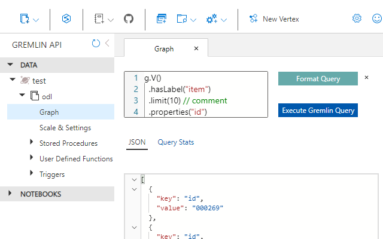

# Cosmos Graph Portal Enhancements
Chrome extension to enhance the Cosmos graph query editor in the portal.

- Replace query input field with an editor (enables multiline/line breaks, syntax highlighting, indention, line numbers)
- Ability to format the query
- Auto resizes the height of the query window
- Enable line breaks
  (enter will insert a line break, shift + enter or ctrl + enter executes the query)
- Changes editor appearance in json result

[Chrome Web Store](https://chrome.google.com/webstore/detail/kafgakbjaooedlknboeegpjeiddfofpb)
